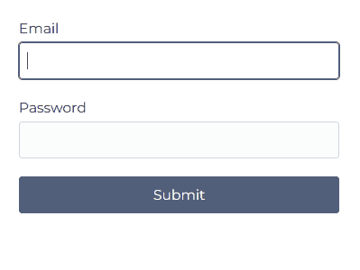

# valifield

The minimalist's form validation tool

## Contents

- [Features](#features)
- [Usage](#usage)
- [Example](#example)
- [License](#license)

## Features

- Tiny: because less > more
- Simple: because fck complexity
- Extensible: you can add props when needed

**Embrace Minimalism**

- Complexity is not your friend, no matter how trendy and promoted it is

- Every feature added is one or more potential failure points

- Most programming languages and major frameworks are more than sufficient for
  the majority of applications

- Why spend half a day learning a library that economizes a few lines of
  code at the expense of clarity, control and often significantly increasing
  your bundle size?

- It's hard to enjoy development and get into flow when you constantly need
  to read docs

## Usage

```sh
npm i valifield
```

```ts
import { createField } from "valifield"

const username = createField("");

console.log(username); // -> { value: '', error: '', disabled: false }
```

## Example



```svelte
<!-- LoginForm.svelte -->

<script context="module" lang="ts">
  import { z } from "zod";

  const schema = {
    email: z.string().email(),
    password: z.string().min(4)
  };
</script>

<script lang="ts">
  import { enhance } from "$app/forms";
  import { createField } from "valifield";

  let validating = false; // realtime validation flag, triggered on submit

  const email = createField("");

  $: email.error = schema.email.safeParse(email.value).success
    ? ""
    : "Not a valid email";

  const password = createField("");

  $: password.error = schema.password.safeParse(password.value).success
    ? ""
    : "Must have at least 4 chars";

  const submit = {
    disabled: false
  };

  $: submit.disabled = validating && (!!email.error || !!password.error);

  async function onSubmit(event: SubmitEvent) {
    validating = false;
    if (email.error || password.error) {
      event.preventDefault();
      event.stopImmediatePropagation();
      validating = true;
    }
  }
</script>

<form
  action="/?/login"
  method="post"
  on:submit={onSubmit}
  use:enhance
>
  <label>
    Email
    <input
      name="email"
      aria-invalid={validating && email.error ? "true" : undefined}
      aria-describedby="email-error"
      bind:value={email.value}
    />
    <small id="email-error">
      {validating ? email.error : ""}
    </small>
  </label>

  <label class="grid gap-2">
    Password
    <input
      type="password"
      name="password"
      aria-invalid={validating && password.error ? "true" : undefined}
      aria-describedby="password-error"
      bind:value={password.value}
    />
    <small id="password-error">
      {validating ? password.error : ""}
    </small>
  </label>

  <button type="submit" disabled={submit.disabled}>Submit</button>
</form>
```

## License

[MIT](LICENSE)
